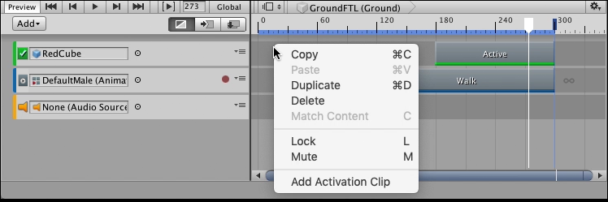

# 添加剪辑

Timeline Editor 窗口支持根据轨道的类型采用不同方法将剪辑添加到轨道。

最快的方法是右键单击轨道中的空白区域，然后从上下文菜单中选择相应的 Add 选项。根据轨道不同，添加剪辑的选项也会发生变化。剪辑会添加到轨道上的最后一个剪辑之后。

_Context menu for adding an Activation clip._

There are other ways to add clips:

- Select a clip option from the Track menu in the Track Header to add a clip at the location of the Timeline Playhead.
- Drag an animation Source Asset from the Project window to an empty area in the Timeline window to automatically create an Animation track and add an Animation clip.
- Drag an animation Source Asset from the Project window to an existing track in the Timeline window to add an Animation clip to the same track.
- Drag an audio Source Asset from the Project window to an empty area in the Timeline window to automatically create an Audio track and add an Audio clip.
- Drag a GameObject with a PlayableDirector component to create a nested Timeline instance. This automatically creates a Control track and adds a Control clip for the nested Timeline instance.
- Drag a Prefab from the Project window to an empty area in the Timeline window to add a Prefab instance to your Timeline instance. This automatically creates a Control track and adds a Control clip for the Prefab instance.
- Drag a GameObject with a Particle component to add a particle effect to your Timeline instance. This automatically creates a Control track and adds a Control clip for the duration of the Particle effect.

When you add a clip, the [selected Clip Edit mode](clp_about) determines how the added clip interacts with surrounding clips. For example, if you add an Animation clip or an Audio clip in Mix mode and the added clip intersects a clip on the same track, Timeline [creates a blend](clp_blend).
