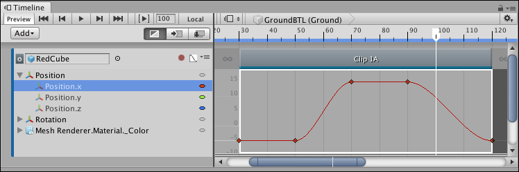

# 隐藏和显示关键帧

对于所选动画剪辑，曲线视图随动画曲线提供一个属性层级视图列表。通过展开、选择和取消选择此列表中的属性，可过滤曲线视图中显示的动画曲线。

例如，要仅显示沿 X 轴的位置的动画曲线，请展开 Position 并选择 Position.x 属性。按 F 即可定格 Position.x 属性的动画曲线。

_Curves view showing the animation curve for the Position.x property_

There are many ways to expand, collapse, select, and deselect animation curves:

- Click the Triangle icon of a parent property to expand and collapse its list of child properties.
- Hold Shift and click to select contiguous properties.
- Hold Command/Control and click to select discontiguous properties. Hold Command/Control and click a selected property to deselect it.
