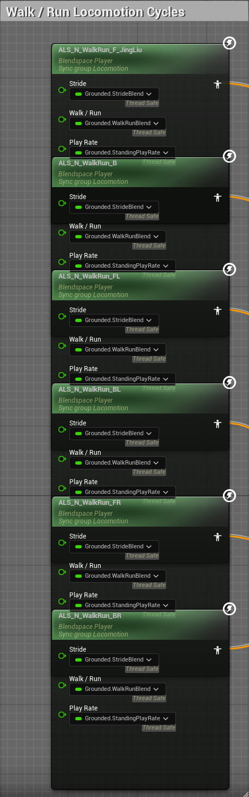
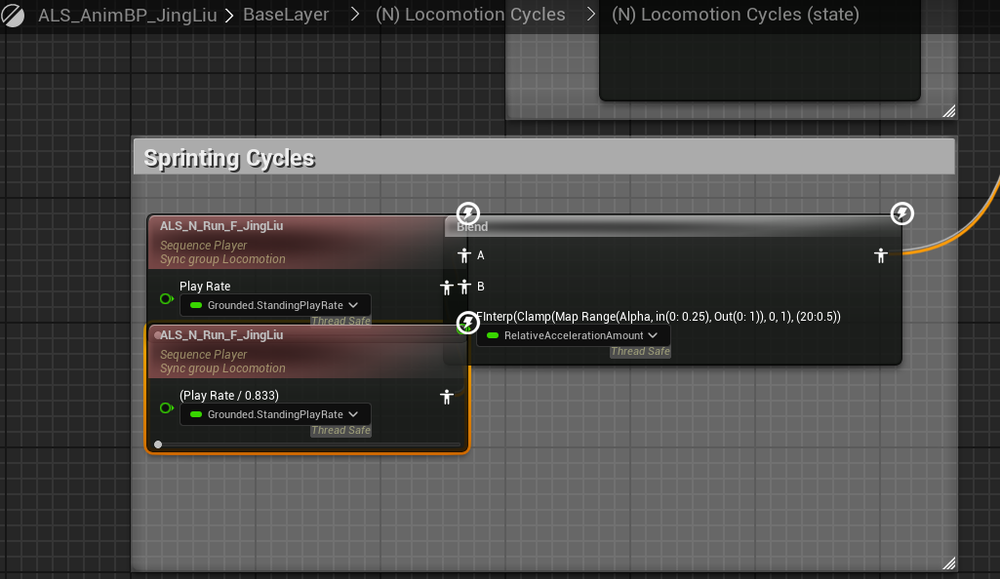

# Advanced Locomotion System V4

## BaseLayer

### Locomotion Cycles

#### Locomotion Cycles (state)

### Main Movement States

- 前
- 后
- 前左
- 前右
- 后左
- 后右

## BasePoses
站蹲混合
### Locomotion
走跑混合
#### Sprinting 加速
