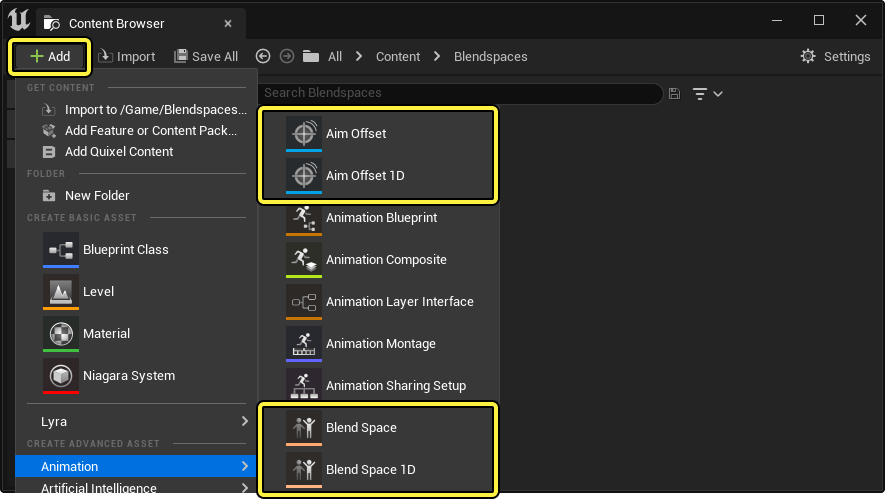

---
sidebar_position: 1
---

# 混合空间

## 混合空间创建和类型

- 瞄准偏移（Anim Offset）
- 瞄准偏移1D （Anim Offset 1D）
- 混合空间（Blend Space）
- 混合空间1D（Blend Space 1D）

### 瞄准偏移

瞄准偏移是混合控件，旨在包含网格体空间叠加动画作为示例。通常，这些用于创建武器或其他“看向”瞄准混合空间。瞄准偏移动画蓝图节点旨在随法线轴输入一起接受输入姿势
